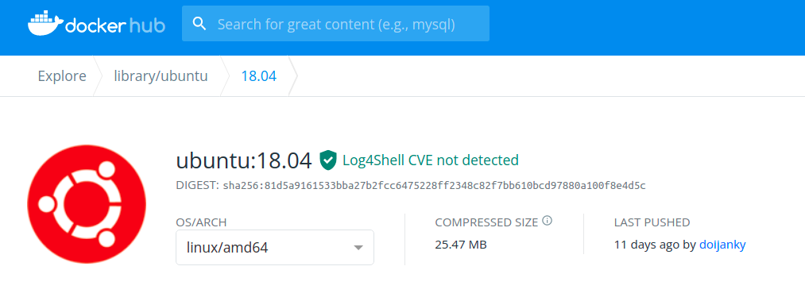
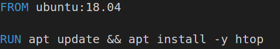
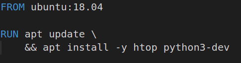
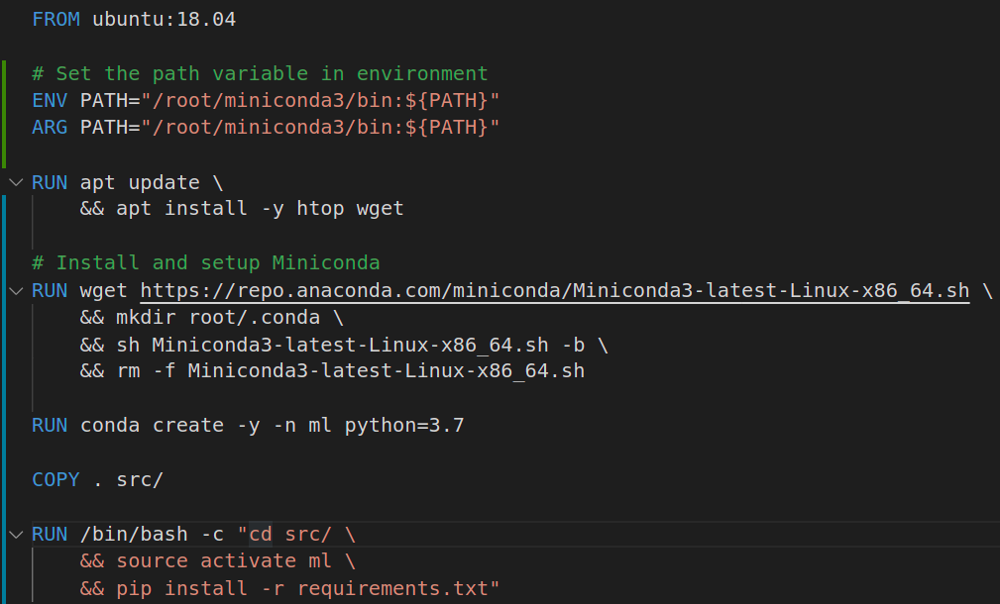
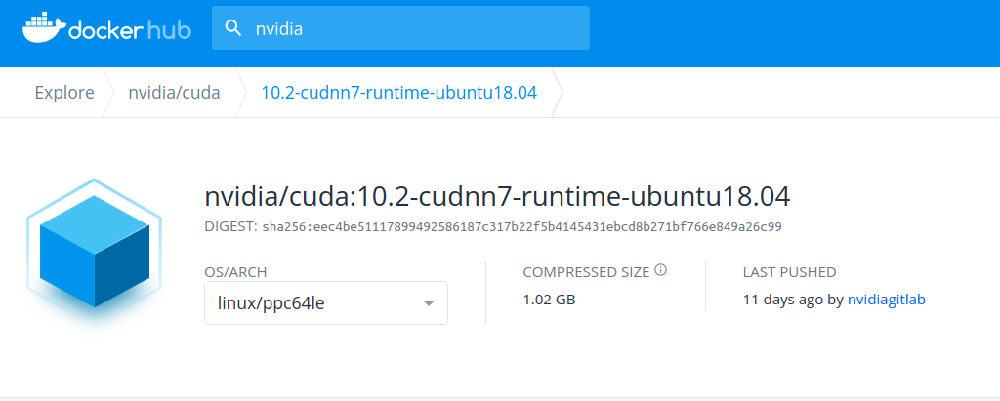
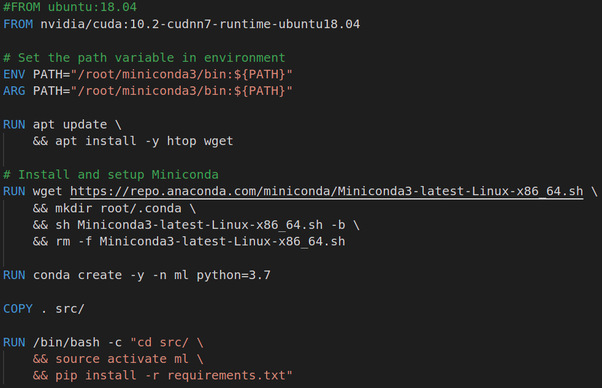
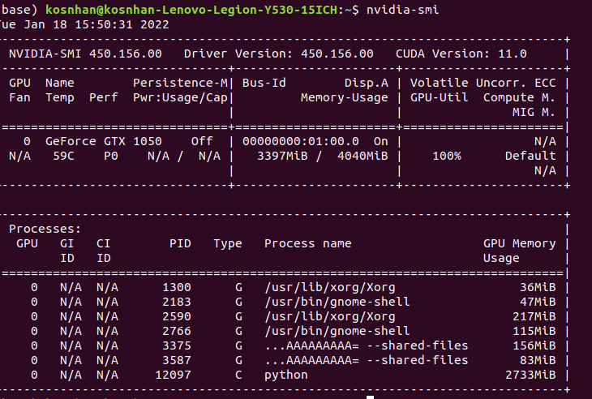

# Docker-Tutorial - Deeplearnining-Sample-1

This repository from [click-here](https://github.com/abhishekkrthakur/bert-sentiment). 

I follow the tutorial from [here](https://www.youtube.com/watch?v=0qG_0CPQhpg) for learning how to create Dockerfile for data science project.

## Ex1
**Searching Docker hub:**



**Dockerfile:**



**Build Docker image:**
```bash
docker build -f Dockerfile -t docker_tutorial .
```

**Run and access inside Docker Container:**
```bash
docker run -it docker_tutorial /bin/bash
```

*/bin/bash* for running bash inside container.

**Run htop inside container:** 
```bash
htop
```
*If it's works, mean you create successfully.*

## Ex2: Create python environment.

**Dockerfile:**



**Build Docker image:**
```bash
docker build -f Dockerfile -t docker_tutorial .
```

**Run and access inside Docker Container:**
```bash
docker run -it docker_tutorial /bin/bash
```

**Check python version inside container:**
```bash
python3
```

## Ex3: Download and setup Miniconda.

**Dockerfile:**



**Build Docker image:**
```bash
docker build -f Dockerfile -t docker_tutorial .
```

**Run and access inside Docker Container:**
```bash
docker run -it docker_tutorial /bin/bash
```

**Check conda environment inside container:**
```bash
source activate ml
conda list
```

**Check folder src inside container:**
```bash
cd src
ls
```

**Start training data**

Start training when run Docker container

```bash
docker run -it docker_tutorial /bin/bash -c "cd src/ && source activate ml && python train.py"
```

Or if you inside container
```bash
cd src
python train.py
```

*Note:* In src/ folder must contain dataset - train.csv (we guide in the following example) and configure content in config.py with DEVICE = "cpu", MODEL_PATH = "model.bin" and TRAINING_FILE = "train.csv".

## Ex4: `docker run -v` - Volume.

Once thing you must remember in Docker Container is when you `exit` then all files in container are gone. Therefore when you start to training model and save checkpoint inside container is not saved.
That's why we must use [Volume](https://docs.docker.com/storage/volumes/). 

Follow step-by-step:

**Create new folder in your local to store data that are created when Docker container running:**
```bash
mkdir ../docker_data
```

**Configure the config.py:**

DEVICE = "cpu"

MODEL_PATH = "/root/docker_data/model.bin"

TRAINING_FILE = "/root/docker_data/train.csv"

**Move train.csv**
```bash
mv train.csv ../docker_data
```

**Build Docker image:**
```bash
docker build -f Dockerfile -t docker_tutorial .
```

**Run Docker Container with Volume:**
```bash
docker run -v /home/kosnhan/Projects-Python/Docker-Tutorial/docker_data/:/root/docker_data -it docker_tutorial /bin/bash
```

**Explore how does Volume work:**

```bash
ls root/docker_data/
```
*Output:* train.csv

```bash
touch temp.txt
exit
```

Check folder in your local:
```bash
ls ../docker_data/
``` 
*Output:* temp.txt &emsp; train.csv

That's mean when Docker Container create some new files that will save in your local.

**Start training data with Volume:**
```bash
docker run -v /home/kosnhan/Projects-Python/Docker-Tutorial/docker_data/:/root/docker_data -it docker_tutorial /bin/bash -c "cd src/ && source activate ml && python train.py"
```

## Ex4: Docker Container with CUDA version.

**Verify CUDA Version inside container:**
```bash
CUDA_VISIBLE_DEVICE=1
docker run --gpus 1 -it docker_tutorial /bin/bash
nvidia-smi
```

*Note:* If you get error like
```bash
docker: Error response from daemon: could not select device driver "" with capabilities: [[gpu]].
ERRO[0000] error waiting for container: context canceled 
```
Please follow [here](https://github.com/NVIDIA/nvidia-docker/issues/1034) to solve this error.

**Searching Docker Image with specific CUDA and CUDNN version:**


**Dockerfile:**


*Note:* configure config.py with DEVICE = "cuda".

**Build Docker image:**
```bash
docker build -f Dockerfile -t docker_tutorial .
```

**Start training data:**
```bash
docker run --gpus all -v /home/kosnhan/Projects-Python/Docker-Tutorial/docker_data/:/root/docker_data -it docker_tutorial /bin/bash -c "cd src/ && source activate ml && python train.py"
```

**Check GPU memory:**

Output:


