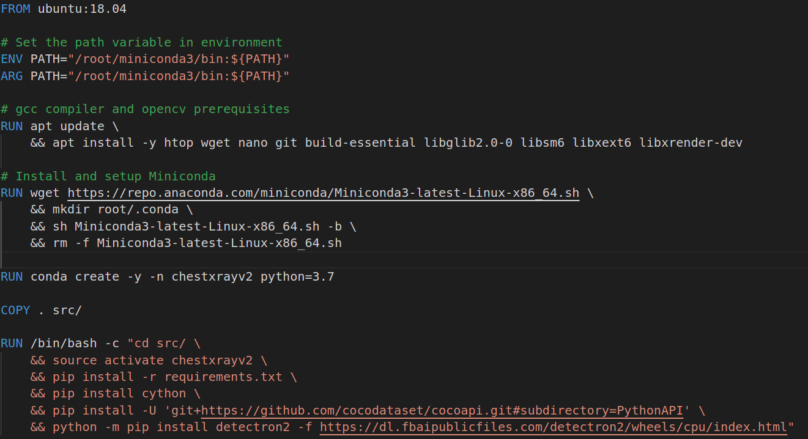
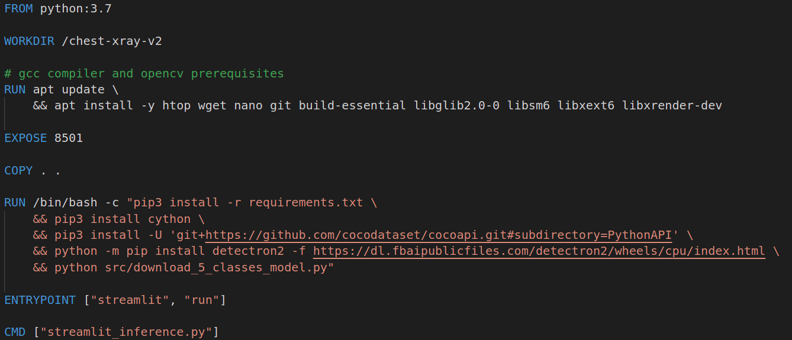

# Docker-Tutorial - Chest-Xray-Version2-Deployment

This repository from [click-here](https://github.com/DatacollectorVN/Chest-Xray-Version2).

We create Dockerfile with purposes:
+ Install and setup Detectron2.
+ Run website by Streamlit.

## Ex1: Setup Detectron2 and run website by Streamlit.

**Dockerfile:**



**Build Docker image:**
```bash
docker build -f Dockerfile -t chestxrayv2 .
```

**Run Docker Container and connect port in local:**
```bash
docker run -p 8501:8501 -it chestxrayv2 /bin/bash
```

**Run streamlit**
```bash
source activate chestxrayv2
cd src/
python src/download_5_classes_model.py
streamlit run streamlit_inference.py
```


## Ex2: Dockerfile with CMD and ENTRYPOINT.
  
**Dockerfile:**



**Build Docker image:**
```bash
docker build -f Dockerfile -t chestxrayv2 .
```

**Run Docker Container and connect port in local:**
```bash
docker run -p 8501:8501 chestxrayv2
```